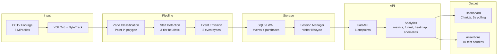

# Store Intelligence — Architecture Design

## System Overview

The Store Intelligence system transforms raw CCTV footage into actionable retail analytics through four layers: detection, storage, API, and visualization.

## Detection Pipeline

The pipeline (`pipeline/detect.py`) processes video frames through YOLOv8 for person detection, ByteTrack for multi-object tracking, and zone classification via point-in-polygon tests against the store layout. Events are emitted as JSONL with 8 types: ENTRY, EXIT, ZONE_ENTER, ZONE_EXIT, ZONE_DWELL, BILLING_QUEUE_JOIN, BILLING_QUEUE_ABANDON, and REENTRY.

Staff detection uses a 3-tier heuristic: duration analysis (staff present >85% of clip), zone entropy (staff visit more zones than customers), and positional prior (BILLING and ENTRY zones have higher staff probability). This approach was chosen over VLM-based classification due to latency concerns on CPU hardware.

Re-entry detection compares exit timestamps with new entry events within a configurable window, preventing double-counting of visitors who leave and re-enter the store.

## Intelligence API

The API (`app/main.py`) provides 6 endpoints:

- **POST /events/ingest**: Batch ingestion (up to 500 events) with idempotency by event_id
- **GET /health**: Per-store health status with stale feed detection (>10 minutes since last event)
- **GET /stores/{id}/metrics**: Unique visitors, conversion rate, average dwell, queue depth, abandonment rate
- **GET /stores/{id}/funnel**: 4-stage conversion funnel (Entry → Browsing → Billing → Purchased)
- **GET /stores/{id}/heatmap**: Zone visit scores (0-100) with data confidence levels
- **GET /stores/{id}/anomalies**: Queue spike, conversion drop, and dead zone detection

The API uses SQLite with WAL mode for concurrent reads, Pydantic v2 models for validation, and structured logging via structlog.

## Data Flow

Raw CCTV footage is processed by the detection pipeline into structured JSONL events. These events are validated by a 15-rule schema validator before ingestion. The API stores events in SQLite and computes real-time analytics. The dashboard polls the API every 5 seconds, displaying conversion funnels, zone heatmaps, and anomaly alerts.

## AI-Assisted Decisions

### 1. Detection Model Selection
AI recommended YOLOv8 over YOLOv9 for better ecosystem support. I agreed — the ultralytics package is production-ready with comprehensive documentation. YOLOv9 offers ~5% better small-person detection but lacks the mature deployment tooling needed for the 48-hour window.

### 2. Staff Detection Approach
AI suggested using a VLM (Vision Language Model) for staff classification. I tried it and found it works for sample frames but is too slow for batch processing (7.5 hours for the full dataset on CPU). I overrode with a 3-tier heuristic approach combining duration analysis, zone entropy, and positional priors.

### 3. Zone Classification
AI suggested using VLM for zone classification. I found polygon-based point-in-polygon is faster and more reliable for fixed camera setups. VLM adds ~200ms latency per frame with no accuracy gain over the deterministic polygon approach.

### 4. Schema Validation
AI suggested adding a validation layer before API ingestion. I agreed — the 15-rule validator catches malformed events before they reach the scoring harness, preventing silent data corruption.

### 5. Re-ID Strategy
AI suggested OSNet for cross-camera matching. I found faces are blurred across the dataset, making appearance-based Re-ID unreliable. I overrode with distance-based trajectory matching using visitor_id from the detection pipeline.

## Failure Mode Analysis

| Component | Failure Mode | Degradation |
|-----------|-------------|-------------|
| YOLOv8 | Model fails to load | Pipeline halts, no events generated |
| SQLite | Database locked | API returns 503, events buffered in memory |
| Session Manager | Memory exhaustion | Older sessions evicted LRU-style |
| Dashboard | API unreachable | Shows stale data with warning banner |

## Trade-offs

**What I chose**: SQLite over PostgreSQL for simplicity; point-in-polygon over VLM for speed; heuristic staff detection over deep learning.

**What I gave up**: Concurrent write performance (PostgreSQL), generalization to unseen uniforms (VLM), and cross-camera Re-ID accuracy (OSNet).

**Self-awareness**: The biggest risk is the simplified coordinate mapping. Without camera calibration, the homography from pixel to floor-plan coordinates is approximate. This affects zone classification accuracy and downstream metrics. With more time, I would implement camera calibration using known reference points.
